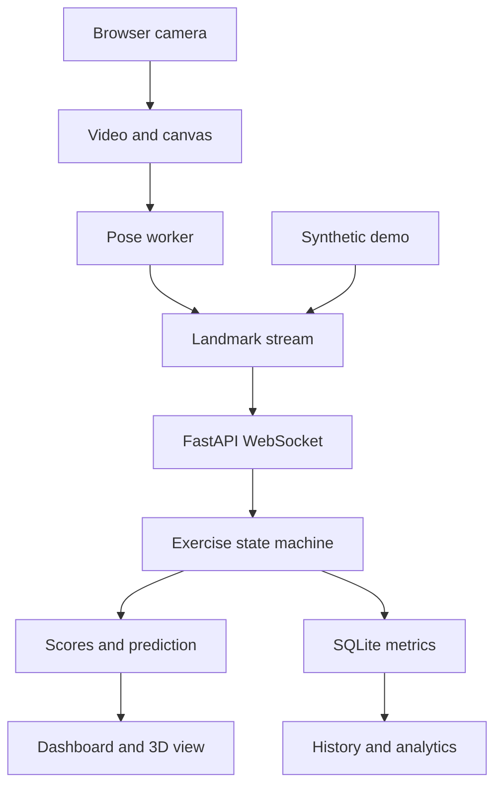

# MotionMind — Predictive Human Motion Intelligence

A runnable, local-first AI workout assistant based on the supplied MotionMind dashboard concept. React + TypeScript, a CPU MediaPipe Pose Lite worker, FastAPI, WebSocket analysis, SQLAlchemy and SQLite. Includes source code, a prebuilt frontend, the pose model, local WASM assets, deterministic demo streams, automated tests and setup scripts.

## Quick start on Windows

1. Install **Python 3.12 (64-bit)** with the Python Launcher. Python 3.11 also works. Do not use Python 3.14 with this pinned release.
2. Extract the ZIP completely to a writable folder, such as `C:\Projects\motionmind`. Do not run inside the ZIP viewer.
3. Double-click **`setup.bat`**. The first run installs Python dependencies and opens the app at **http://127.0.0.1:8000**.
4. For later runs, double-click **`start.bat`**. Keep its terminal window open.
5. Select **Demo → Start workout** to test immediately without a camera. For real tracking, finish the demo, select **Webcam → Connect camera**, allow access, and then **Start workout**.

**Node.js is not needed for the prebuilt quick start.** Internet is needed to install Python dependencies the first time. The model and browser WASM assets are included, so the app does not download them during camera use. Browser voice services may have their own connectivity requirements; voice is off by default.

## Linux / macOS

Install Python 3.12 or 3.11 with `venv`, then run:

```bash
bash setup.sh
# Subsequent runs:
bash start.sh
```

## What works

- Responsive dashboard, live video and canvas skeleton overlay; lightweight Three.js current/projected pose view.
- MediaPipe Pose Lite inference in a **classic Web Worker**, CPU delegate, single in-flight frame, adaptive inference rate and reduced processing resolution when slow.
- Guided tracking for 14 exercises; squat-pattern indication; 2D aspect-corrected joint angles, EMA smoothing, low-visibility rejection.
- State-machine rep counting with hysteresis, minimum duration, gap reset, pause reset, observed ROM and per-rep phase timing. Plank uses valid hold seconds.
- Transparent form-score components and cooldown-limited coaching. Optional voice and rep sounds.
- Short-horizon trajectory extrapolation with direction consistency and threshold ETA. Clearly labelled **deterministic baseline**, not a trained motion predictor.
- Editable/reorderable workout plans, set targets, start/pause/resume/skip/rest/finish, camera selection and performance settings.
- SQLite sessions, sets, repetitions, sampled form/motion metrics, feedback events and progress summaries; exports and deletion.
- History/detail views and charts with 7/30/90-day/all-time filters. Synthetic demo history is isolated from real workout progress.
- Matching-session comparisons only when past data exists. No seeded or fabricated workout statistics.

## Important implementation boundaries

This is a **working local single-user release**, not an audited medical product or an internet-ready multi-tenant service. Exercise modes are deterministic guided rules, and their thresholds need evaluation on representative real movement. Select the exercise you intend to perform. The squat indicator recognizes a simple squat-like pattern within guided squat mode; there is no trained general-purpose exercise classifier. Reverse-lunge direction is user-selected. The similarity of several exercises cannot be resolved by one joint angle alone.

Form scores are transparent heuristics, not calibrated measures of biomechanical correctness or injury risk. Angle-based ROM is in degrees. Tempo is **toward peak / return**, which is not always the same as eccentric/concentric phase. Symmetry is unavailable for one-sided or alternating measurements. Calories use a rough MET estimate and profile weight, not a physiological measurement. The 3D view uses relative pose coordinates, not calibrated motion capture.

No trained LSTM/GRU model is included. No accuracy, CPU FPS or sub-100 ms guarantee is claimed. Automated tests exercise synthetic sequences; they do not establish recognition accuracy in real-world conditions. Physical webcam and individual exercise accuracy should be checked on your device. See [VALIDATION.md](docs/VALIDATION.md).

## Supported modes

| Group | Exercises | Preferred camera view |
|---|---|---|
| Lower body | Squat, lunge, reverse lunge | Side |
| Upper body | Push-up, bicep curl, tricep extension | Side; curls may use front |
| Upper body | Shoulder press, lateral raise | Front |
| Core | Plank, sit-up, crunch, leg raise | Side |
| Cardio | Jumping jack; mountain climber | Front; side respectively |

Alternating lunge/climber movements count each completed drive individually. Plank targets are seconds, not reps. Use one fully visible person, good lighting and a steady camera. Keep required joints in view.

## Development

Use Python 3.12 and Node.js 20+ (22 LTS recommended for this project).

```bash
# Terminal 1, from project root
python -m venv .venv
# Windows: .venv\Scripts\activate
# Linux/macOS: source .venv/bin/activate
python -m pip install -r backend/requirements-dev.txt
cd backend
python -m uvicorn app.main:app --reload --host 127.0.0.1 --port 8000

# Terminal 2
cd frontend
npm ci
npm run assets
npm run dev
```

Open http://127.0.0.1:5173. Vite proxies `/api` and `/ws` to FastAPI. `npm run build` creates the frontend served by the backend for quick start. `python scripts/setup.py --rebuild` installs and rebuilds everything.

## Tests

```bash
cd backend
python -m pip install -r requirements-dev.txt
python -m pytest -q

cd ../frontend
npm ci
npm test
npm run build
# Regenerate synthetic pose fixtures if demo code changes:
node scripts/generate-fixtures.mjs
```

## Docker

```bash
docker compose up --build
```

Open http://127.0.0.1:8080. The compose stack uses a frontend container, backend container, and a persistent SQLite volume. SQLite does not require a separate database container. Camera processing stays in your host browser. Docker files are supplied; container execution validation is documented separately.

## Architecture



Only landmarks cross the loopback connection. Video and raw pose sequences are not stored. Database work and analysis execute in background threads; the browser renders independently.

## Files and documentation

- [Architecture and schema](docs/ARCHITECTURE.md)
- [API and WebSocket protocol](docs/API.md) — interactive API docs: http://127.0.0.1:8000/docs
- [Model setup and third-party provenance](docs/MODELS.md)
- [Performance and configuration](docs/PERFORMANCE.md)
- [Troubleshooting](docs/TROUBLESHOOTING.md)
- [Validation results and limitations](docs/VALIDATION.md)
- [Research roadmap](docs/RESEARCH_ROADMAP.md)

Default data: `data/motionmind.db`. Copy `.env.example` to `.env` to customize the launcher. Bind to loopback for this local release; do not expose it publicly without authentication, authorization, transport security, and a deployment review.

AI fitness guidance is informational and does not replace professional medical or fitness advice. Stop exercising if you experience pain, dizziness, or unusual symptoms.
